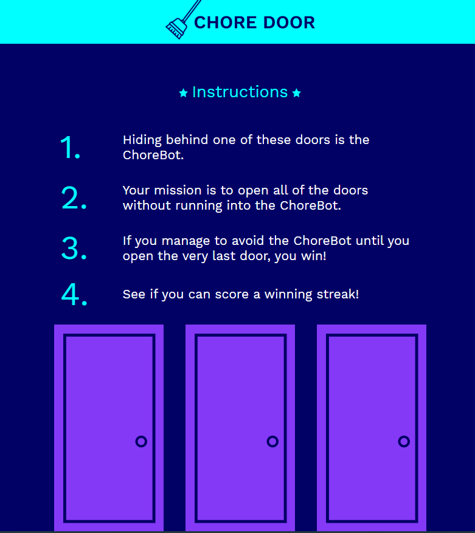

# Chore Door
> Chore Door is a dynamic website designed with HTML5, CSS3, and JavaScript. It was done using an outline from [Codecademy](https://www.codecademy.com). The website renders a single-page door-guessing game where the objective is to avoid selecting the random door that the Chore Bot is hiding behind.

## Table of Contents
* [General Info](#general-info)
* [Screenshot and Instructions](#screenshot-and-instructions)
* [Technologies](#technologies)
* [Setup](#setup)
* [Features](#features)
* [Status](#status)

## General Info
The door the Chore Bot is behind is randomized every round, so be careful! This is accomplished by randomizing the images "behind" the doors. The images are provided by [Codecademy.com].

## Screenshot and Instructions


## Technologies
* HTML5
* CSS3
* JavaScript

## Setup
To play, simply clone the repository and open `index.html`.

## Code Examples
Show examples of usage:
```javascript
//Door assignments
const doorImage1 = document.getElementById('door1');
const doorImage2 = document.getElementById('door2');
const doorImage3 = document.getElementById('door3');
//Image of the Chore Bot
const botDoorPath = 'https://s3.amazonaws.com/codecademy-content/projects/chore-door/images/robot.svg';
//Image of the beach
const beachDoorPath = 'https://s3.amazonaws.com/codecademy-content/projects/chore-door/images/beach.svg';
```
```html
<!-- Score Board -->
    <div class="score-row">
      <table class="score-table">
        <tr class="streak-row">
          <td class="streak-text">Current Streak</td>
        </tr>
        <tr>
          <td id="current" class="score-text">0</td>
        </tr>
      </table>
      <table class="score-table">
        <tr class="streak-row">
          <td class="streak-text">Best Streak</td>
        </tr>
        <tr>
          <td id="best" class="score-text">0</td>
        </tr>
      </table>
    </div>
    <script type="text/javascript" src="./resources/script.js"></script>
```

## Features
* A game that renders in the browser
* Randomized placement of the Chore Bot makes each round fun and exciting
* Door selections can be made and new rounds started without reloading the webpage

## Status
Project is: _finished_. If any updates are made, they will be cosmetic or refactoring changes.
